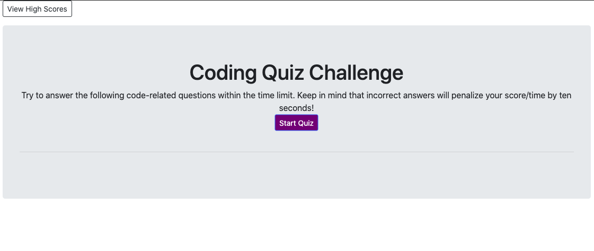

# gt-code-quiz

## Description 

This app uses DOM manipulation, timing functions, and local storage to provide the user with a five-question quiz on coding basics. Scores are based on the amount of time remaining at the end of the quiz and can be saved locally.

## Table of Contents 

* [Installation](#installation)
* [Usage](#usage)
* [Credits](#credits)
* [License](#license)

## Installation

Pull the repo from github and run index.html. 

[The page can also be accessed here.](https://mjmoon15.github.io/gt-code-quiz/)

## Usage 

Players can click the start button to begin the quiz. The first question is loaded and the user is presented with four choices. Incorrect answers will subtract 10 seconds from the timer. The game ends when the timer runs out or the user answers all five questions. The user is then able to enter their initials to save their score.

## Credits

The GT-ATL May 2020 cohort study groups helped with the concepts displayed on this page.

## License

MIT License

Copyright (c) [2020] [Mark J Mooney]

Permission is hereby granted, free of charge, to any person obtaining a copy
of this software and associated documentation files (the "Software"), to deal
in the Software without restriction, including without limitation the rights
to use, copy, modify, merge, publish, distribute, sublicense, and/or sell
copies of the Software, and to permit persons to whom the Software is
furnished to do so, subject to the following conditions:

The above copyright notice and this permission notice shall be included in all
copies or substantial portions of the Software.

THE SOFTWARE IS PROVIDED "AS IS", WITHOUT WARRANTY OF ANY KIND, EXPRESS OR
IMPLIED, INCLUDING BUT NOT LIMITED TO THE WARRANTIES OF MERCHANTABILITY,
FITNESS FOR A PARTICULAR PURPOSE AND NONINFRINGEMENT. IN NO EVENT SHALL THE
AUTHORS OR COPYRIGHT HOLDERS BE LIABLE FOR ANY CLAIM, DAMAGES OR OTHER
LIABILITY, WHETHER IN AN ACTION OF CONTRACT, TORT OR OTHERWISE, ARISING FROM,
OUT OF OR IN CONNECTION WITH THE SOFTWARE OR THE USE OR OTHER DEALINGS IN THE
SOFTWARE.

---
© 2019 Trilogy Education Services, a 2U, Inc. brand. All Rights Reserved.

